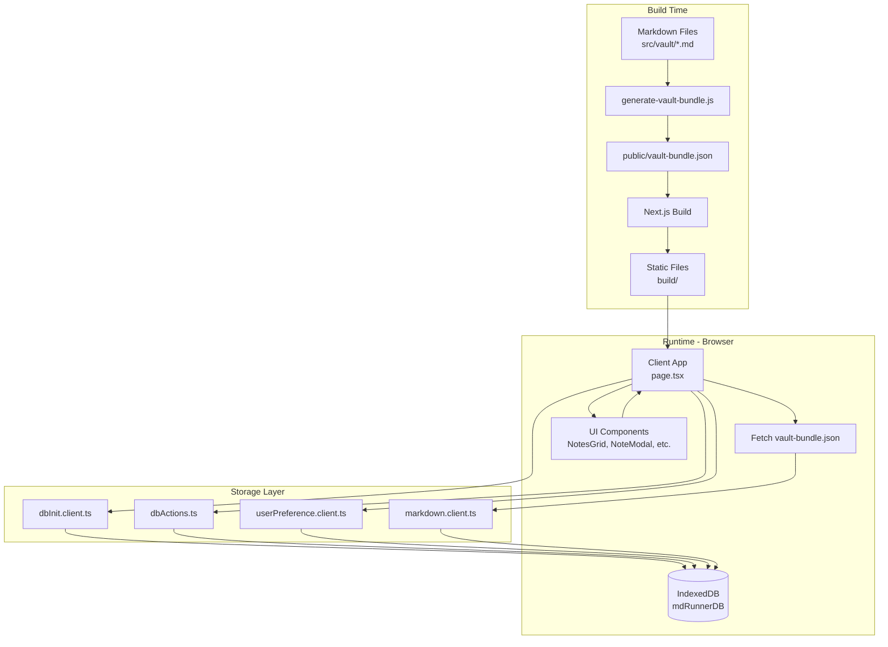

# Getting Started

Hello!!
This is  a **PWA**(I hope this is) that powers my personal blog where i share things I learn, break and eventually understand.
The content lives as Markdown files in my local vault.
You can replace those files with your own and instantly turn this into your blog.

# Why PWA ?

Several reasons but most of it is

- I cannot afford a self hosted server (emotionally and financially).
- I do not want to maintain a backend service.
- GitHub Pages + PWA felt like the most peaceful solution.

# Architecture KT (I did my best)

This is a frontend-only PWA built with Next.js that runs entirely in the browser. The architecture is intentionally simple: no backend, no API calls (except fetching the vault bundle), and all user data lives in IndexedDB. It's designed to be deployed as static files to GitHub Pages, which means zero server costs and zero server maintenance.

## Overview

The app follows a straightforward flow: markdown files from your local `src/vault/` directory get bundled into a JSON file at build time. At runtime, the client loads this bundle along with any user-created notes from IndexedDB, merges them, and displays everything in a Notion-like interface. User preferences (bookmarks, folders, selected Kural) are also stored in IndexedDB.

## Components & Responsibilities

- **`page.tsx`**: The main orchestrator. Manages global state (notes, folders, modals), handles note/folder creation, and coordinates between UI components and storage layer.

- **`NotesGrid`**: Renders notes in a responsive grid. Handles bookmark toggling and note selection. Keeps its own local state for bookmarks to avoid prop drilling.

- **`NoteModal`**: Displays note content in a modal with collapsible markdown sections. Also handles note creation (though editing isn't implemented yet — see "Reality Check" below).

- **`CollapsibleMarkdown`**: Parses markdown using `marked`, builds a tree structure from headings (H1-H3), and renders collapsible sections. All headings are expanded by default because life's too short to click through collapsed content.

- **`KuralHeader`**: Displays a random Tamil quote (Thirukkural) that can be set as default. It's a nice touch, but honestly, it's just there because I wanted it.

- **Storage Layer**:
  - **`dbInit.client.ts`**: Initializes IndexedDB with object stores for notes, user preferences, bookmarks, folders, and app defaults.
  - **`dbActions.ts`**: Wraps IndexedDB operations using a custom `indexdb-action` library. Handles CRUD for notes and preferences.
  - **`markdown.client.ts`**: Loads vault bundle from `/vault-bundle.json` and merges with IndexedDB notes. User-created notes take precedence if slugs collide.
  - **`userPreference.client.ts`**: Manages user preferences (bookmarks, folders, default Kural) in IndexedDB.

- **Build Process**:
  - **`generate-vault-bundle.js`**: Prebuild script that reads all `.md` files from `src/vault/`, parses frontmatter with `gray-matter`, and outputs `public/vault-bundle.json`. This happens before Next.js build, so the bundle is available as a static asset.

## Data Flow

1. **Build Time**:
   - Prebuild script scans `src/vault/` → generates `public/vault-bundle.json`
   - Next.js builds static export to `build/` directory

2. **Runtime**:
   - Client fetches `/vault-bundle.json` (static markdown content)
   - Client reads from IndexedDB (user-created notes, preferences)
   - Both are merged (user notes override vault notes if slug matches)
   - UI renders the combined list

3. **User Actions**:
   - Creating a note → writes to IndexedDB → updates local state
   - Bookmarking → updates preferences in IndexedDB → updates local state
   - Creating folders → stores folder metadata in preferences → filters notes client-side

## Storage Architecture

All data lives in IndexedDB via a custom wrapper library (`indexdb-action`). The database has five object stores:

- **`notes`**: User-created notes (slug as key, NoteData as value)
- **`user_preferences`**: Single document with bookmarks, folders, default Kural
- **`bookmarks`**: (Currently unused — bookmarks are in user_preferences)
- **`folder_groups`**: (Currently unused — folders are in user_preferences)
- **`app_defaults`**: (Reserved for future use)

The storage layer abstracts away IndexedDB's callback-based API with a promise-based interface. It's not perfect, but it works.

## Build & Deployment

The app uses Next.js static export (`output: "export"`) configured for GitHub Pages with a base path. The build process:

1. Runs `generate-vault-bundle.js` (prebuild hook)
2. Next.js builds static HTML/JS/CSS to `build/` directory
3. GitHub Pages serves the `build/` directory

No server-side rendering happens at runtime. Everything is static files served from GitHub's CDN.

## System Design



## Reality Check

Here are the trade-offs and intentional simplifications:

- **No editing**: You can create notes, but editing isn't implemented. The modal shows content in read-only mode. This was a conscious choice to keep things simple (or maybe I just ran out of time — you decide).

- **No sync**: Each browser has its own IndexedDB. There's no way to sync notes across devices. This is fine for a personal blog, but don't expect cloud sync.

- **Vault bundle size**: All markdown files are bundled into a single JSON file and loaded upfront. If you have hundreds of large files, the initial load might be slow. Consider lazy loading if this becomes an issue.

- **Client-side only**: Everything happens in the browser. No server means no authentication, no rate limiting, no server-side validation. The app trusts the client (which is fine for a personal blog, but don't use this pattern for anything sensitive).

- **IndexedDB abstraction**: The custom `indexdb-action` library is a side project. It works, but it's not battle-tested at scale. If you hit IndexedDB quirks, you're on your own.

- **Folder implementation**: Folders are just metadata stored in preferences. They don't actually organize files — they just filter the note list client-side. It's a UI convenience, not a file system.

- **No PWA manifest**: Despite being called a PWA, there's no `manifest.json` or service worker in the codebase. The "PWA" claim is aspirational at best. (Installability and offline support would require actual PWA features.)

The architecture prioritizes simplicity and zero operational overhead over features. It's a personal blog, not a production SaaS. If you need more, you'll need to add more (or use something else).

# Pre-Requisites

To run this locally you will need

- Node 18.
- Code editor (vs code).
- Patience.
- Curiosity.
- Redbull (Optional).

# Running Application

To start the app in dev mode

```bash
npm run dev
```

To build the app

```bash
npm run build
```

To deploy:

- Enable GitHub Pages for this repository.
- Trigger the Production GitHub Action.
- That’s it. No servers, no databases, no stress.

# Forking & Contributions

- Fork it
- Clone it
- Break it
- Improve it
Just… please don’t report me!
